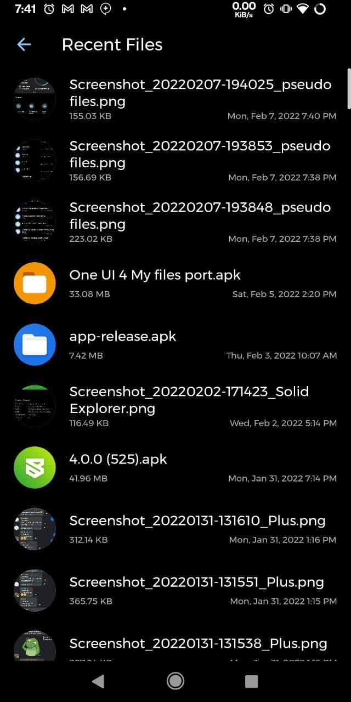

# Pseudofiles [WIP]

A File Explorer made with Flutter (and bits of Java).

You may ask what is the need for another file explorer when there are is a lot of beautiful open and closed source file managers out there for android. And that is true, but none of them is based on Flutter. While this app definitely doesn't solve any unsolved problems, it always good to have options I guess.

Some portion of the code for this project was inspired from [file_manager](https://github.com/DevsOnFlutter/file_manager) plugin for Flutter. While this plugin could be used definitely, but I wanted to scratch the logic from scratch so that I could modify it as needed and [file_manager](https://github.com/DevsOnFlutter/file_manager) definitely helped in some parts, so credits to them for building such an awespme library. UI is heavily inspired from [Solid Explorer](https://play.google.com/store/apps/details?id=pl.solidexplorer2) file manager as I love their UI. I am open to suggestions for the change in UI since it may appear as a clone sometimes.

## Features:
- [x] Recent Files.
- [x] Installed Apps.
- [x] All APKs in storage
- [x] Audios
- [x] Videos
- [x] Pictures
- [ ] Search.
- [x] Sort Files.
- [x] Show/Hide Hidden files.
- [x] Copy/Move/Paste Files [Still wip as it occupies the UI, need to provide background support].
- [x] Delete Files/Folders.
- [x] Rename Files/Folders.
- [x] Dark/White Mode.
- [ ] Material 3 Support

## ScreenShots
  
  
 

## LICENCE
[GPLv3](https://github.com/Android-Builds/pseudofiles/blob/main/LICENSE)
